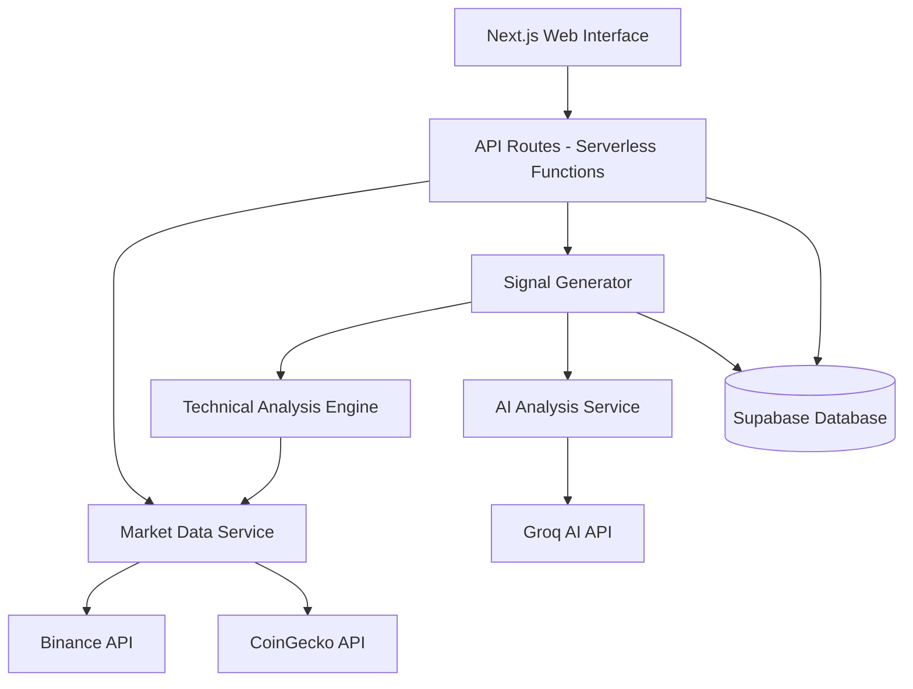

# Design Document: Crypto Trading Signals Generator

## Overview

The Crypto Trading Signals Generator is a Next.js web application that provides real-time cryptocurrency trading signals based on technical analysis and AI-powered market insights. The system fetches live market data from free APIs, calculates technical indicators, applies confluence rules, and generates actionable trading signals with risk management parameters.

The architecture follows a serverless approach optimized for Vercel's free tier, with Supabase providing PostgreSQL database services. The system prioritizes reliability through fallback mechanisms, rate limit handling, and graceful degradation when external services are unavailable.

## Architecture

### System Components



### Technology Stack

- **Frontend**: Next.js 14 (App Router), React, TypeScript
- **Styling**: Tailwind CSS
- **Backend**: Next.js API Routes (Serverless Functions)
- **Database**: Supabase (PostgreSQL)
- **Market Data**: Binance API (primary), CoinGecko API (fallback)
- **AI Analysis**: Groq API (free tier)
- **Technical Indicators**: technicalindicators npm package
- **Deployment**: Vercel (free tier)

### Deployment Architecture

The application runs entirely on Vercel's serverless infrastructure:
- Static pages are served from Vercel's CDN
- API routes execute as serverless functions with cold start optimization
- Environment variables store API keys securely
- Supabase handles database connections with connection pooling

## Components and Interfaces

### 1. Market Data Service

**Responsibility**: Fetch and cache real-time cryptocurrency price data from external APIs.

**Interface**:
```typescript
interface MarketDataService {
  fetchOHLCV(pair: string, timeframe: string, limit: number): Promise<OHLCV[]>
  getCurrentPrice(pair: string): Promise<number>
  getVolume(pair: string, timeframe: string): Promise<number[]>
}

interface OHLCV {
  timestamp: number
  open: number
  high: number
  low: number
  close: number
  volume: number
}
```

**Implementation Details**:
- Primary data source: Binance API (`/api/v3/klines` endpoint)
- Fallback: CoinGecko API (`/api/v3/coins/{id}/ohlc` endpoint)
- Caching strategy: Store recent data in memory with 30-second TTL for 1m timeframe, 5-minute TTL for higher timeframes
- Rate limiting: Implement request queue with max 10 requests per second for Binance
- Error handling: Retry failed requests up to 3 times with exponential backoff (1s, 2s, 4s)

### 2. Technical Analysis Engine

**Responsibility**: Calculate technical indicators and identify patterns from market data.

**Interface**:
```typescript
interface TechnicalAnalysisEngine {
  calculateRSI(prices: number[], period: number): number
  calculateMACD(prices: number[]): MACDResult
  calculateEMA(prices: number[], period: number): number
  calculateBollingerBands(prices: number[], period: number, stdDev: number): BollingerBands
  identifySupportResistance(ohlcv: OHLCV[]): SupportResistance
  analyzeVolume(volumes: number[]): VolumeAnalysis
  detectTrend(prices: number[]): Trend
}

interface MACDResult {
  macd: number
  signal: number
  histogram: number
}

interface BollingerBands {
  upper: number
  middle: number
  lower: number
}

interface SupportResistance {
  support: number[]
  resistance: number[]
}

interface VolumeAnalysis {
  averageVolume: number
  currentVolume: number
  isVolumeSpike: boolean
}

type Trend = 'BULLISH' | 'BEARISH' | 'NEUTRAL'
```

**Implementation Details**:
- Use `technicalindicators` library for standard calculations
- RSI: 14-period default, overbought > 70, oversold < 30
- MACD: Fast period 12, slow period 26, signal period 9
- EMA: Calculate for 20, 50, and 200 periods
- Bollinger Bands: 20-period SMA, 2 standard deviations
- Support/Resistance: Identify local minima/maxima in last 50 candles
- Volume spike: Current volume > 2x average volume of last 20 periods
- Trend detection: Compare EMA 20 vs EMA 50 positions

### 3. AI Analysis Service

**Responsibility**: Generate natural language market analysis using free AI APIs.

**Interface**:
```typescript
interface AIAnalysisService {
  analyzeMarket(indicators: IndicatorData, ohlcv: OHLCV[]): Promise<AIAnalysis>
}

interface IndicatorData {
  rsi: number
  macd: MACDResult
  ema20: number
  ema50: number
  ema200: number
  bollingerBands: BollingerBands
  trend: Trend
  volumeAnalysis: VolumeAnalysis
}

interface AIAnalysis {
  summary: string
  confidence: number
  keyPoints: string[]
}
```

**Implementation Details**:
- Primary AI provider: Groq API with llama-3.1-8b-instant model
- Prompt engineering: Provide structured indicator data and request concise analysis
- Timeout: 10 seconds maximum for AI response
- Fallback: If AI unavailable, generate rule-based summary from indicators
- Rate limiting: Max 30 requests per minute (Groq free tier limit)
- Response caching: Cache AI analysis for same indicator state (5-minute TTL)

### 4. Signal Generator

**Responsibility**: Generate trading signals by applying confluence rules and calculating risk parameters.

**Interface**:
```typescript
interface SignalGenerator {
  generateSignal(pair: string, timeframe: string): Promise<Signal>
}

interface Signal {
  pair: string
  timeframe: string
  timestamp: number
  trend: Trend
  signalType: 'BUY' | 'SELL' | 'NO_TRADE'
  entryPrice: number
  stopLoss: number
  takeProfit1: number
  takeProfit2: number
  riskRewardRatio: number
  winProbability: number
  analysisSummary: string
  indicatorConfirmations: string[]
  riskLevel: 'LOW' | 'MEDIUM' | 'HIGH'
  tradeType: 'SCALP' | 'SWING' | 'POSITION'
}
```

**Implementation Details**:

**Confluence Rules for BUY Signal** (require at least 3):
1. RSI < 40 (oversold territory)
2. MACD histogram positive and increasing
3. Price above EMA 20 or EMA 20 crossing above EMA 50
4. Price near lower Bollinger Band
5. Volume spike detected
6. Price breaking above recent resistance

**Confluence Rules for SELL Signal** (require at least 3):
1. RSI > 60 (overbought territory)
2. MACD histogram negative and decreasing
3. Price below EMA 20 or EMA 20 crossing below EMA 50
4. Price near upper Bollinger Band
5. Volume spike detected
6. Price breaking below recent support

**Risk Calculation**:
- Stop Loss: 2.5% from entry (below for BUY, above for SELL)
- Take Profit 1: 1.5x the stop loss distance
- Take Profit 2: 3x the stop loss distance
- Risk-Reward Ratio: (TP2 - Entry) / (Entry - Stop Loss)
- Win Probability: Base 50% + (5% × number of confirmations above minimum)

**Risk Level Determination**:
- LOW: 5+ confirmations, RR ratio > 2.5
- MEDIUM: 3-4 confirmations, RR ratio 1.5-2.5
- HIGH: 3 confirmations, RR ratio < 1.5

**Trade Type by Timeframe**:
- SCALP: 1m, 5m
- SWING: 15m, 1h, 4h
- POSITION: 1D

### 5. Database Service

**Responsibility**: Store and retrieve signals, track performance metrics.

**Schema**:
```sql
-- Signals table
CREATE TABLE signals (
  id UUID PRIMARY KEY DEFAULT gen_random_uuid(),
  pair VARCHAR(20) NOT NULL,
  timeframe VARCHAR(10) NOT NULL,
  timestamp TIMESTAMPTZ NOT NULL,
  trend VARCHAR(10) NOT NULL,
  signal_type VARCHAR(10) NOT NULL,
  entry_price DECIMAL(20, 8) NOT NULL,
  stop_loss DECIMAL(20, 8) NOT NULL,
  take_profit_1 DECIMAL(20, 8) NOT NULL,
  take_profit_2 DECIMAL(20, 8) NOT NULL,
  risk_reward_ratio DECIMAL(5, 2) NOT NULL,
  win_probability INTEGER NOT NULL,
  analysis_summary TEXT NOT NULL,
  indicator_confirmations JSONB NOT NULL,
  risk_level VARCHAR(10) NOT NULL,
  trade_type VARCHAR(10) NOT NULL,
  outcome VARCHAR(20), -- WIN, LOSS, BREAKEVEN, OPEN
  close_price DECIMAL(20, 8),
  close_timestamp TIMESTAMPTZ,
  created_at TIMESTAMPTZ DEFAULT NOW()
);

CREATE INDEX idx_signals_pair_timeframe ON signals(pair, timeframe);
CREATE INDEX idx_signals_timestamp ON signals(timestamp DESC);
CREATE INDEX idx_signals_outcome ON signals(outcome) WHERE outcome IS NOT NULL;

-- Performance metrics table
CREATE TABLE performance_metrics (
  id UUID PRIMARY KEY DEFAULT gen_random_uuid(),
  pair VARCHAR(20) NOT NULL,
  timeframe VARCHAR(10) NOT NULL,
  total_signals INTEGER NOT NULL,
  winning_signals INTEGER NOT NULL,
  losing_signals INTEGER NOT NULL,
  win_rate DECIMAL(5, 2) NOT NULL,
  average_rr DECIMAL(5, 2) NOT NULL,
  last_updated TIMESTAMPTZ DEFAULT NOW(),
  UNIQUE(pair, timeframe)
);
```

**Interface**:
```typescript
interface DatabaseService {
  saveSignal(signal: Signal): Promise<string>
  getSignalHistory(pair: string, timeframe: string, limit: number): Promise<Signal[]>
  updateSignalOutcome(signalId: string, outcome: string, closePrice: number): Promise<void>
  getPerformanceMetrics(pair: string, timeframe: string): Promise<PerformanceMetrics>
  updatePerformanceMetrics(pair: string, timeframe: string): Promise<void>
}

interface PerformanceMetrics {
  totalSignals: number
  winningSignals: number
  losingSignals: number
  winRate: number
  averageRR: number
}
```

### 6. Web Interface

**Pages and Components**:

**Main Dashboard** (`/app/page.tsx`):
- Current signal display card (large, prominent)
- Trading pair selector dropdown
- Timeframe selector buttons
- Real-time price ticker
- Performance metrics summary
- Signal history table

**Components**:
- `SignalCard`: Displays current signal with all parameters
- `PairSelector`: Dropdown for selecting trading pairs
- `TimeframeSelector`: Button group for timeframe selection
- `SignalHistory`: Table showing past signals
- `PerformanceMetrics`: Cards displaying win rate, total signals, avg RR
- `Disclaimer`: Persistent risk disclaimer banner
- `LoadingState`: Skeleton loaders for async data

**State Management**:
- Use React hooks (useState, useEffect) for local state
- Implement polling mechanism to refresh signals every 60 seconds
- Use SWR or React Query for data fetching and caching

**Styling Guidelines**:
- Dark theme with green (bullish) and red (bearish) accents
- Professional trading terminal aesthetic
- Responsive grid layout (mobile-first)
- Clear typography hierarchy
- Accessible color contrast ratios

## Data Models

### Core Data Types

```typescript
// Trading pair configuration
type TradingPair = 'BTC/USDT' | 'ETH/USDT' | 'BNB/USDT' | 'SOL/USDT' | 'ADA/USDT'

// Timeframe options
type Timeframe = '1m' | '5m' | '15m' | '1h' | '4h' | '1D'

// Signal types
type SignalType = 'BUY' | 'SELL' | 'NO_TRADE'

// Trend types
type Trend = 'BULLISH' | 'BEARISH' | 'NEUTRAL'

// Risk levels
type RiskLevel = 'LOW' | 'MEDIUM' | 'HIGH'

// Trade types
type TradeType = 'SCALP' | 'SWING' | 'POSITION'

// Signal outcome
type Outcome = 'WIN' | 'LOSS' | 'BREAKEVEN' | 'OPEN'
```

### Configuration

```typescript
interface AppConfig {
  supportedPairs: TradingPair[]
  supportedTimeframes: Timeframe[]
  apiKeys: {
    groq: string
    supabaseUrl: string
    supabaseKey: string
  }
  rateLimit: {
    binanceRequestsPerSecond: number
    groqRequestsPerMinute: number
  }
  cache: {
    marketDataTTL: Record<Timeframe, number>
    aiAnalysisTTL: number
  }
  signalGeneration: {
    minimumConfluence: number
    stopLossPercentage: number
    takeProfitMultipliers: [number, number]
  }
}
```

## Correctness Properties

*A property is a characteristic or behavior that should hold true across all valid executions of a system—essentially, a formal statement about what the system should do. Properties serve as the bridge between human-readable specifications and machine-verifiable correctness guarantees.*


### Property 1: Market Data Fetching Across Pairs and Timeframes

*For any* supported trading pair and timeframe, when the Market Data Service requests price data, it should successfully fetch and return valid OHLCV data with all required fields (timestamp, open, high, low, close, volume).

**Validates: Requirements 1.1, 1.2, 1.3**

### Property 2: API Retry with Exponential Backoff

*For any* failed API request, the system should retry with exponentially increasing delays (1s, 2s, 4s) and fall back to alternative data sources after exhausting retries.

**Validates: Requirements 1.5, 9.1**

### Property 3: Rate Limiting and Request Queuing

*For any* service with rate limits (Market Data, AI Analysis), when request frequency approaches the limit, the system should queue requests and process them within the allowed rate.

**Validates: Requirements 1.4, 4.5, 9.5**

### Property 4: RSI Calculation Correctness

*For any* price series with at least 14 data points, the calculated RSI should be between 0 and 100, and should match the standard RSI formula: RSI = 100 - (100 / (1 + RS)) where RS is the average gain divided by average loss.

**Validates: Requirements 2.1**

### Property 5: MACD Calculation Correctness

*For any* price series with sufficient data points, the calculated MACD should have the histogram equal to (MACD line - Signal line), and the MACD line should equal (EMA12 - EMA26).

**Validates: Requirements 2.2**

### Property 6: EMA Calculation Correctness

*For any* price series and period, the calculated EMA should follow the formula: EMA_today = (Price_today × multiplier) + (EMA_yesterday × (1 - multiplier)), where multiplier = 2 / (period + 1).

**Validates: Requirements 2.3**

### Property 7: Bollinger Bands Calculation Correctness

*For any* price series with at least 20 data points, the middle band should equal the 20-period SMA, and the upper/lower bands should be exactly 2 standard deviations away from the middle band.

**Validates: Requirements 2.4**

### Property 8: Insufficient Data Validation

*For any* indicator calculation, when provided with fewer data points than required for the calculation period, the system should reject the calculation and return an appropriate error.

**Validates: Requirements 2.5**

### Property 9: Support and Resistance Identification

*For any* OHLCV series, identified support levels should correspond to local minima (prices lower than surrounding prices) and resistance levels should correspond to local maxima (prices higher than surrounding prices).

**Validates: Requirements 2.6**

### Property 10: Volume Spike Detection

*For any* volume series, a volume spike should be detected if and only if the current volume exceeds 2x the average volume of the previous 20 periods.

**Validates: Requirements 2.7**

### Property 11: Trend Detection Consistency

*For any* price series with EMA 20 and EMA 50 calculated, the trend should be BULLISH when EMA 20 > EMA 50, BEARISH when EMA 20 < EMA 50, and NEUTRAL when they are approximately equal (within 0.1%).

**Validates: Requirements 3.1**

### Property 12: Breakout Detection

*For any* price series with identified support/resistance levels, a breakout should be detected when the current price crosses a support level (downward) or resistance level (upward) with confirmation.

**Validates: Requirements 3.2**

### Property 13: AI Service Fallback Behavior

*For any* signal generation request, if the AI Analysis Service is unavailable or times out, the system should still generate a valid signal using only technical indicators without failing.

**Validates: Requirements 4.4, 9.3**

### Property 14: AI Analysis Response Structure

*For any* successful AI analysis request, the response should contain a non-empty summary string, a confidence value between 0 and 100, and a list of key points.

**Validates: Requirements 4.2, 4.3**

### Property 15: Confluence Rule for Signal Generation

*For any* set of indicator confirmations, a BUY or SELL signal should be generated if and only if at least 3 indicators agree on the direction; otherwise, the signal should be NO_TRADE.

**Validates: Requirements 5.1, 5.2**

### Property 16: Entry Price Equals Current Price

*For any* generated signal, the entry price should equal the current market price at the time of signal generation (within 0.01% tolerance for rounding).

**Validates: Requirements 5.3**

### Property 17: Stop Loss Distance Validation

*For any* BUY signal, the stop loss should be 2-3% below the entry price; for any SELL signal, the stop loss should be 2-3% above the entry price.

**Validates: Requirements 5.4**

### Property 18: Take Profit Multiplier Validation

*For any* generated signal, TP1 should be positioned at 1.5x the risk distance from entry, and TP2 should be positioned at 3x the risk distance from entry, where risk distance is |entry - stop loss|.

**Validates: Requirements 5.5**

### Property 19: Risk-Reward Ratio Calculation

*For any* generated signal, the risk-reward ratio should equal (TP2 - Entry) / |Entry - Stop Loss| for BUY signals, and (Entry - TP2) / |Stop Loss - Entry| for SELL signals.

**Validates: Requirements 5.6**

### Property 20: Win Probability Calculation

*For any* generated signal, the win probability should equal 50 + (5 × (number of confirmations - 3)), bounded between 50% and 100%.

**Validates: Requirements 5.7**

### Property 21: Complete Signal Structure

*For any* generated signal, it should contain all required fields: pair, timeframe, timestamp, trend (BULLISH/BEARISH/NEUTRAL), signalType (BUY/SELL/NO_TRADE), entryPrice, stopLoss, takeProfit1, takeProfit2, riskRewardRatio, winProbability, analysisSummary, indicatorConfirmations, riskLevel (LOW/MEDIUM/HIGH), and tradeType (SCALP/SWING/POSITION).

**Validates: Requirements 6.1, 6.2, 6.3, 6.4, 6.5, 6.6, 6.7, 6.8, 6.9, 6.10**

### Property 22: Trade Type Derivation from Timeframe

*For any* generated signal, the trade type should be SCALP for 1m/5m timeframes, SWING for 15m/1h/4h timeframes, and POSITION for 1D timeframe.

**Validates: Requirements 6.10**

### Property 23: Signal Persistence Round Trip

*For any* generated signal, storing it to the database and then retrieving it should produce a signal with equivalent field values (within acceptable precision for decimal fields).

**Validates: Requirements 7.1**

### Property 24: Signal Outcome Updates

*For any* stored signal, updating its outcome with a close price should result in the signal having the specified outcome and close price when retrieved.

**Validates: Requirements 7.2**

### Property 25: Performance Metrics Calculation

*For any* set of signals with outcomes, the calculated win rate should equal (winning signals / total closed signals) × 100, and the average RR should equal the mean of risk-reward ratios for all closed signals.

**Validates: Requirements 7.3**

### Property 26: Signal Retention Period

*For any* signal stored in the database, it should remain retrievable for at least 90 days from its creation timestamp.

**Validates: Requirements 7.6**

### Property 27: API Response Validation

*For any* API response received from external services, the system should validate the response structure and data types before processing, rejecting invalid responses with appropriate errors.

**Validates: Requirements 9.4**

### Property 28: Error Message Clarity

*For any* error condition (insufficient data, API failure, invalid input), the system should return a clear, descriptive error message indicating the specific problem.

**Validates: Requirements 9.2**

## Error Handling

### Error Categories and Responses

**1. External API Errors**
- **Scenario**: Binance/CoinGecko API unavailable or returns errors
- **Handling**: 
  - Retry with exponential backoff (1s, 2s, 4s)
  - Fall back to alternative API
  - Cache last successful response and serve stale data with warning
  - Log error details for monitoring

**2. Rate Limit Errors**
- **Scenario**: API rate limits exceeded
- **Handling**:
  - Queue requests in memory
  - Process queue at allowed rate
  - Return cached data if available
  - Display "Rate limit reached, using cached data" message to user

**3. Insufficient Data Errors**
- **Scenario**: Not enough historical data for indicator calculation
- **Handling**:
  - Return error with specific message: "Insufficient data: need {required} candles, have {available}"
  - Do not generate signal
  - Suggest using longer timeframe or waiting for more data

**4. AI Service Errors**
- **Scenario**: Groq API unavailable, timeout, or error response
- **Handling**:
  - Fall back to rule-based analysis summary
  - Generate signal using only technical indicators
  - Log AI service failure for monitoring
  - Continue normal operation without AI enhancement

**5. Database Errors**
- **Scenario**: Supabase connection failure or query errors
- **Handling**:
  - Retry database operations up to 3 times
  - Continue signal generation even if storage fails
  - Display signal to user with warning: "Signal generated but not saved"
  - Log error for investigation

**6. Validation Errors**
- **Scenario**: Invalid user input (unsupported pair, invalid timeframe)
- **Handling**:
  - Return 400 Bad Request with specific validation error
  - Provide list of valid options in error message
  - Do not attempt processing

**7. Calculation Errors**
- **Scenario**: Mathematical errors in indicator calculations (division by zero, NaN results)
- **Handling**:
  - Catch exceptions in calculation functions
  - Return null for that specific indicator
  - Continue with remaining indicators
  - Generate NO_TRADE signal if too few indicators available

### Error Response Format

```typescript
interface ErrorResponse {
  error: string
  code: string
  details?: Record<string, any>
  timestamp: number
}
```

### Logging Strategy

- Log all errors with context (pair, timeframe, user action)
- Use structured logging for easy parsing
- Include stack traces for unexpected errors
- Monitor error rates and alert on spikes

## Testing Strategy

### Dual Testing Approach

The system will employ both unit testing and property-based testing to ensure comprehensive coverage:

**Unit Tests**: Focus on specific examples, edge cases, and integration points
- Test specific indicator calculations with known input/output pairs
- Test error conditions with invalid inputs
- Test API integration with mocked responses
- Test UI component rendering with sample data

**Property-Based Tests**: Verify universal properties across all inputs
- Test indicator calculations hold mathematical properties for all valid inputs
- Test signal generation rules apply consistently across all market conditions
- Test data validation rejects all invalid inputs
- Test error handling works for all failure scenarios

### Property-Based Testing Configuration

**Library**: Use `fast-check` for TypeScript/JavaScript property-based testing

**Configuration**:
- Minimum 100 iterations per property test
- Each test tagged with format: `Feature: crypto-trading-signals, Property {N}: {property description}`
- Custom generators for domain types (OHLCV data, trading pairs, timeframes)

**Example Property Test Structure**:
```typescript
import fc from 'fast-check'

// Feature: crypto-trading-signals, Property 4: RSI Calculation Correctness
test('RSI should be between 0 and 100 for any valid price series', () => {
  fc.assert(
    fc.property(
      fc.array(fc.float({ min: 1, max: 100000 }), { minLength: 14, maxLength: 100 }),
      (prices) => {
        const rsi = calculateRSI(prices, 14)
        expect(rsi).toBeGreaterThanOrEqual(0)
        expect(rsi).toBeLessThanOrEqual(100)
      }
    ),
    { numRuns: 100 }
  )
})
```

### Test Coverage Goals

- Unit test coverage: >80% for business logic
- Property test coverage: All 28 correctness properties implemented
- Integration test coverage: All API endpoints and database operations
- E2E test coverage: Critical user flows (select pair, view signal, check history)

### Testing Tools

- **Unit Testing**: Jest
- **Property-Based Testing**: fast-check
- **Integration Testing**: Jest with Supabase test instance
- **E2E Testing**: Playwright
- **API Mocking**: MSW (Mock Service Worker)

### Continuous Testing

- Run unit and property tests on every commit
- Run integration tests on pull requests
- Run E2E tests before deployment
- Monitor test execution time and optimize slow tests
